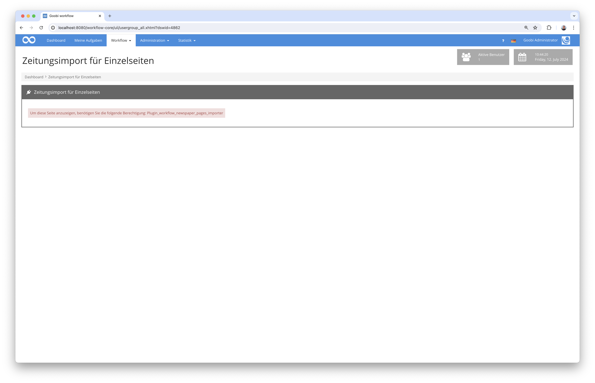
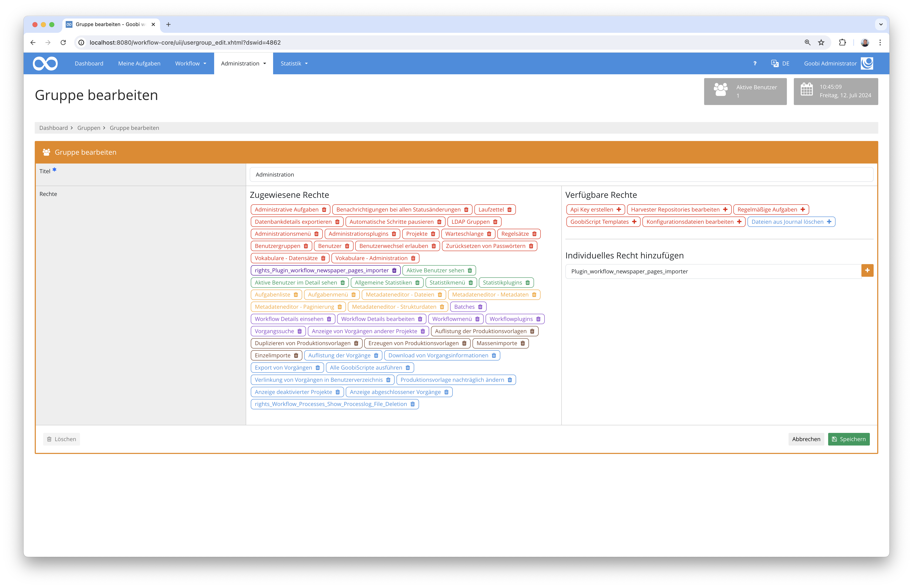
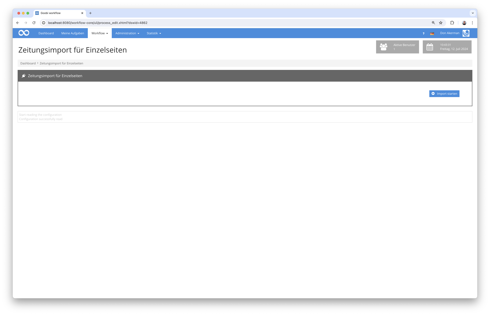
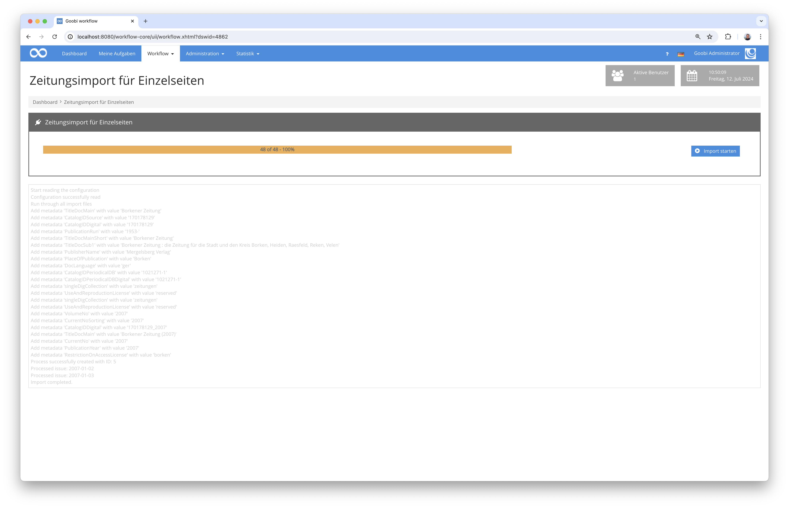

## Einführung
Dieses Workflow-Plugin erlaubt einen Massenimport von Zeitungsausgaben, die als Einzelseiten vorliegen. Für jede in einem Ordner vorliegende Datei wird dabei anhand des Dateinamens das Ausgabendatum sowie die Ausgabennummer ermittelt. Anschließend werden Goobi-Vorgängen auf Jahresebene erzeugt und die Ausgaben samt Metadaten und Seitenzugehörigkeiten erzeugt.

## Installation
Zur Installation des Plugins müssen folgende beiden Dateien installiert werden:

```bash
/opt/digiverso/goobi/plugins/workflow/plugin-workflow-newspaper-pages-importer-base.jar
/opt/digiverso/goobi/plugins/GUI/plugin-workflow-newspaper-pages-importer-gui.jar
```

Um zu konfigurieren, wie sich das Plugin verhalten soll, können verschiedene Werte in der Konfigurationsdatei angepasst werden. Die Konfigurationsdatei befindet sich üblicherweise hier:

```bash
/opt/digiverso/goobi/config/plugin_intranda_workflow_newspaper_pages_importer.xml
```

Für eine Nutzung dieses Plugins muss der Nutzer über die korrekte Rollenberechtigung verfügen.



Bitte weisen Sie daher der Gruppe die Rolle `Plugin_workflow_newspaper_pages_importer` zu.




## Überblick und Funktionsweise
Wenn das Plugin korrekt installiert und konfiguriert wurde, ist es innerhalb des Menüpunkts `Workflow` zu finden.



Nach dem Betreten des Plugins kann der eigentliche Importvorgang gestartet werden. Hierbei wird innerhalb des konfigurierten Quellverzeichnisses nach vorhandenen Dateien gesucht und deren Namen überprüft. Das Benennungsschema innerhalb des Dateinamens muss dafür folgendermaßen aussehen:

```bash
yyyy-MM-dd_AAA.bbb
```

Die Zeichen stehen dabei für das folgende:

Zeichen  | Erläuterung
---------|----------------------------------------
 `yyyy`  | Angabe des vierstelligen Jahres
 `MM`    | Angabe des zweistelligen Monats, ggf. mit führender Null
 `dd`    | Angabe des zweistelligen Tages, ggf. mit führender Null
 `AAA`   | Numerische Ausgabennummer in drei Stellen, ggf. mit führenden Nullen
 `bbb`   | Dateiendung, wie z.B. `pdf`, `jpeg` oder `tif`  

Beispielhaft ein Verzeichnislisting für einen solchen Ordnerinhalt:

```bash
tree /opt/digiverso/import
/opt/digiverso/import
├── 1867-04-06_001.pdf
├── 1867-04-06_002.pdf
├── 1867-04-06_003.pdf
├── 1867-04-06_004.pdf
├── 1867-04-20_001.pdf
├── 1867-04-20_002.pdf
├── 1867-04-20_003.pdf
├── 1867-04-20_004.pdf
├── 1867-05-04_001.pdf
├── 1867-05-04_002.pdf
├── 1867-05-04_003.pdf
├── 1867-05-04_004.pdf
├── 1867-05-11_001.pdf
├── 1867-05-11_002.pdf
├── 1867-05-11_003.pdf
├── 1867-05-11_004.pdf
├── 1867-05-18_001.pdf
├── 1867-05-18_002.pdf
├── 1867-05-18_003.pdf
├── 1867-05-18_004.pdf
├── 1867-05-25_001.pdf
├── 1867-05-25_002.pdf
├── 1867-05-25_003.pdf
├── 1867-05-25_004.pdf
```



Während der Durchführung des Imports werden in Goobi für jedes Jahr ein Vorgang erzeugt, worin für jede Zeitungsausgabe jeweils ein Strukturelement mit den zugehörigen Daten, die aus den Dateinamen sowie aus den Werten der Konfiguration erzeugt wird. 


## Konfiguration
Die Konfiguration des Plugins erfolgt in der Datei `plugin_intranda_workflow_newspaper_pages_importer.xml` wie hier aufgezeigt:

{{CONFIG_CONTENT}}

Parameter                | Erläuterung
-------------------------|----------------------------------------
 `importFolder`          | Mit diesem Parameter wird das Verzeichnis festgelegt, aus dem die Daten importiert werden sollen.
 `workflow`              | Dieser Parameter definiert den Namen der Produktionsvorlage von Goobi, auf dessen Basis die Vorgänge erzeugt werden sollen.
 `processtitle`          | Legen Sie hier fest, wie der Titel der anzulegenden Vorgänge lauten sollen. Ihnen wird beim Erzeugen der Vorgänge die Jahreszahl angefügt (z.B. `New_York_Times_123456789`).
 `pageNumberPrefix`      | Sollen den Seiten in der arabischen Paginierung ein Präfix vorangestellt werden, kann dieser hier definiert werden (z.B. `Seite`). 
 `languageForDateFormat` | Legen Sie hier die Sprache fest, die für die Generierung der Ausgabentitel verwendet werden soll (z.B. `de` oder `en`).
 `issueTitlePrefix`      | Soll vor dem ausführlichem Datum als Titel der Zeitungsausgaben ein Präfix vorangestellt werden, kann dieser hier angegeben werden (z.B. `Ausgabe vom`).
 `deleteFromSource`      | Im Fall, dass die zu importierenden Dateien nach dem Import aus dem Importverzeichnis gelöscht werden sollen, kann dies hier festgelegt werden. 
 `metadata`              |  Mit diesen Elementen kann festgelegt werden, welche Metadaten auf Zeitungs- und auf Bandebene für die anzulegenden Vorgänge eingesetzt werden sollen. Aus jedem hier angegebenen Element wird dabei ein eigenständiges Metadatum erstellt. Es akzeptiert sechs Attribute, wobei `value` und `type` obligatorisch sind, während `var`, `anchor`, `volume` und `person` optional sind. Weitere Einzelheiten finden sich in den Kommentaren innerhalb der Beispielkonfiguration.
