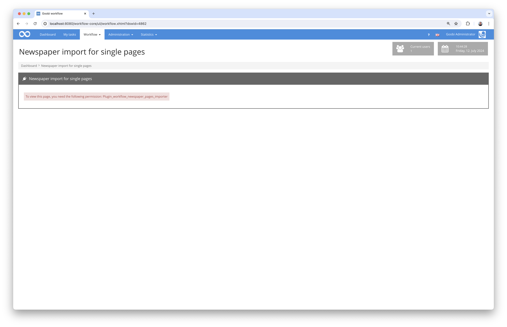
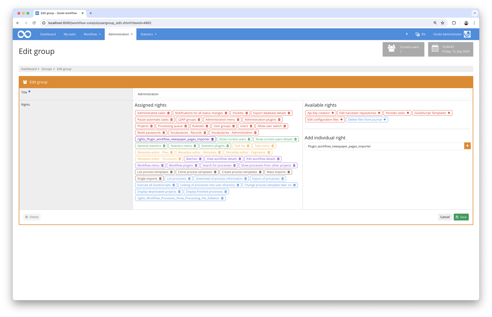
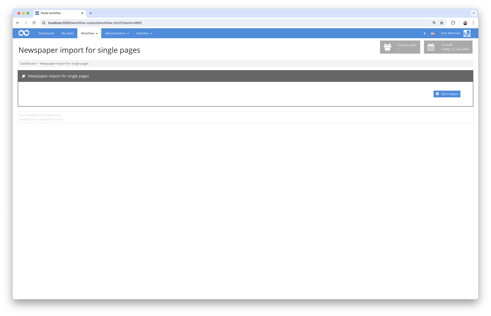
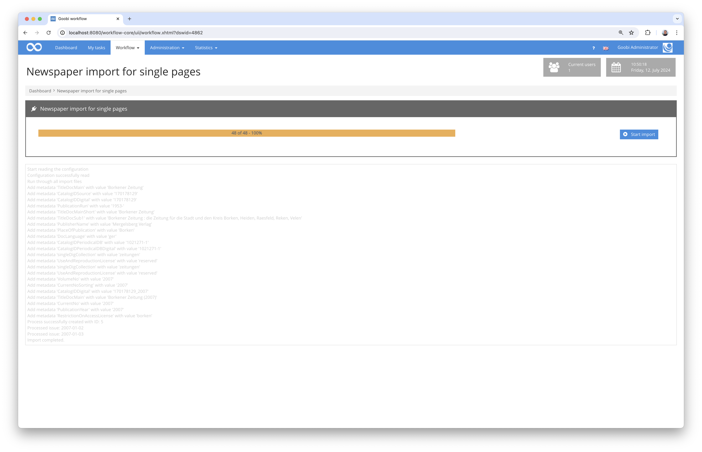

## Introduction
This workflow plugin allows the mass import of newspaper issues that are available as individual pages. For each file in a folder, the issue date and issue number are determined based on the file name. Goobi processes are then created at year level and the issues are generated together with metadata and page associations.

## Installation
To install the plugin, the following two files must be installed:

```bash
/opt/digiverso/goobi/plugins/workflow/plugin-workflow-newspaper-pages-importer-base.jar
/opt/digiverso/goobi/plugins/GUI/plugin-workflow-newspaper-pages-importer-gui.jar
```

To configure how the plugin should behave, various values can be adjusted in the configuration file. The configuration file is usually located here:

```bash
/opt/digiverso/goobi/config/plugin_intranda_workflow_newspaper_pages_importer.xml
```

To use this plugin, the user must have the correct role authorisation.



Therefore, please assign the role `Plugin_workflow_newspaper_pages_importer` to the group.




## Overview and functionality
If the plugin has been installed and configured correctly, it can be found under the 'Workflow' menu item.



After entering the plugin, the actual import process can be started. This involves searching for existing files within the configured source directory and checking their names. The naming scheme within the file name must look like this:

```bash
yyyy-MM-dd_AAA.bbb
```

The characters are in favour of the following:

Character | Explanation
---------|----------------------------------------
 `yyyy`  | Specification of the four-digit year
 `MM`    | Specification of the two-digit month, with leading zero if necessary
 `dd`    | Specification of the two-digit day, with leading zero if necessary
 `AAA`   | Numerical issue number in three digits, with leading zeros if necessary
 `bbb`   | File extension, e.g. `pdf`, `jpeg` or `tif`  

An example of a directory listing for such a folder content:

```bash
tree /opt/digiverso/import
/opt/digiverso/import
├── 1867-04-06_001.pdf
├── 1867-04-06_002.pdf
├── 1867-04-06_003.pdf
├── 1867-04-06_004.pdf
├── 1867-04-20_001.pdf
├── 1867-04-20_002.pdf
├── 1867-04-20_003.pdf
├── 1867-04-20_004.pdf
├── 1867-05-04_001.pdf
├── 1867-05-04_002.pdf
├── 1867-05-04_003.pdf
├── 1867-05-04_004.pdf
├── 1867-05-11_001.pdf
├── 1867-05-11_002.pdf
├── 1867-05-11_003.pdf
├── 1867-05-11_004.pdf
├── 1867-05-18_001.pdf
├── 1867-05-18_002.pdf
├── 1867-05-18_003.pdf
├── 1867-05-18_004.pdf
├── 1867-05-25_001.pdf
├── 1867-05-25_002.pdf
├── 1867-05-25_003.pdf
├── 1867-05-25_004.pdf
```



During the import process, a process is created in Goobi for each year, in which a structural element is created for each newspaper issue with the associated data, which is generated from the file names and the values of the configuration. 


## Configuration
The plugin is configured in the file `plugin_intranda_workflow_newspaper_pages_importer.xml` as shown here:

{{CONFIG_CONTENT}}

Parameter                | Explanation
-------------------------|----------------------------------------
 `importFolder`          | This parameter is used to specify the directory from which the data is to be imported.
 `workflow`              | This parameter defines the name of the Goobi process template on the basis of which the processes are to be generated.
 `processtitle`          | Specify here what the title of the processes to be created should be. The year is added when the processes are created (e.g. `New_York_Times_123456789`).
 `pageNumberPrefix`      | If the pages in the Arabic pagination are to be preceded by a prefix, this can be defined here (e.g. "Page"). 
 `languageForDateFormat` | Specify the language to be used for generating the output titles (e.g. `en` or `de`).
 `issueTitlePrefix`      | If a prefix is to be placed before the detailed date as the title of the newspaper issue, this can be entered here (e.g. "Issue from").
 `deleteFromSource`      | If the files to be imported are to be deleted from the import directory after the import, this can be specified here. 
 `metadata`              |  These elements can be used to specify which metadata should be used at newspaper and volume level for the processes to be created. An independent metadata is created from each element specified here. It accepts six attributes, whereby `value` and `type` are mandatory, while `var`, `anchor`, `volume` and `person` are optional. Further details can be found in the comments within the sample configuration.
